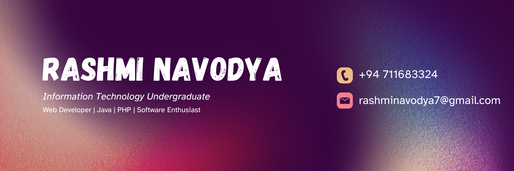

  

<h1 align="center">👋 Hello, I'm Rashmi Navodya</h1>

  🎓 Information Technology Undergraduate  
  💻 Web Developer | Java | PHP Developer  
  🚀 Passionate about Software Development & Building Real-World Applications

---

## 🌟 About Me

I am an Information Technology undergraduate passionate about software development and web technologies. I enjoy building user-friendly applications, solving problems, and continuously learning new skills.

🎯 **Career Objective:** Aspiring Software Engineer seeking opportunities to gain industry experience and grow professionally.

💡 **Interests:** Web Development • Backend Development • Software Engineering • Problem Solving

---

## 🛠️ Tech Stack

### 💻 Programming Languages

### 🌐 Frontend Development

### 🗄️ Database

### 🎨 Design & Other Skills

---

## 📌 Projects

- 🛒 **Bean & Brew Coffee Shop System**
- 🌸 **Online Flower Ordering System (PHP + MySQL - Ongoing)**
- 🏥 **Hospital Management System (Ongoing)**

---

## 📫 Connect With Me

📧 Email: <a href="mailto:rashminavodya7@gmail.com">rashminavodya7@gmail.com</a>  

💼 LinkedIn: <a href="https://www.linkedin.com/in/rashmi-navodya-ba4705311" target="_blank">
linkedin.com/in/rashmi-navodya
</a>  

🌐 GitHub: <a href="https://github.com/rashmi749" target="_blank">
github.com/rashmi749
</a>

---

## ✨ Quote

> "Code is not just instructions, it's a solution to real-world problems."

⭐ Thanks for visiting my GitHub profile!

